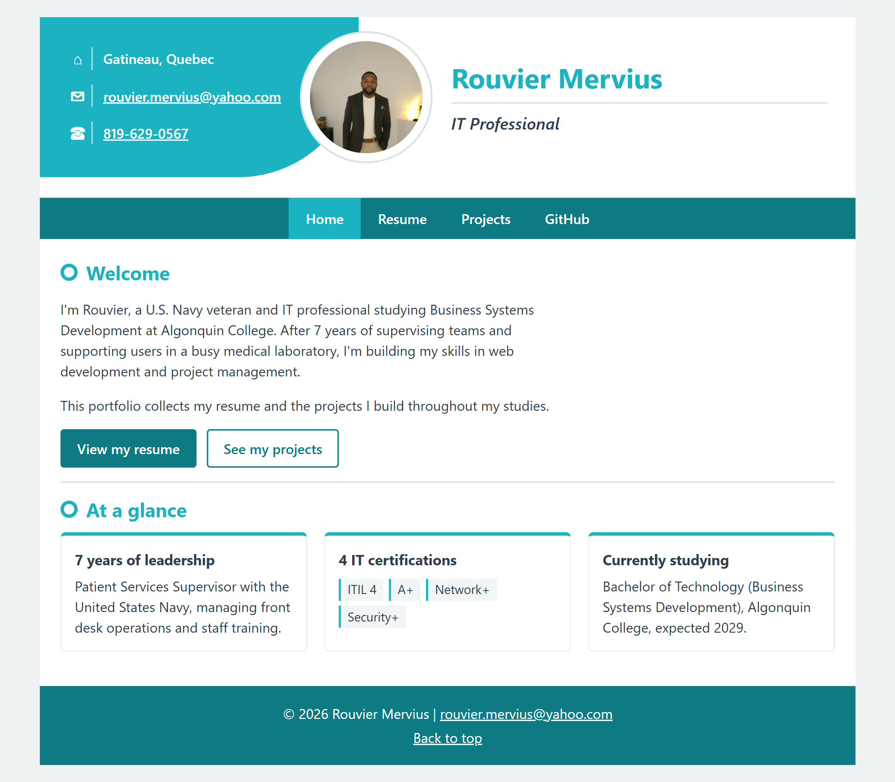
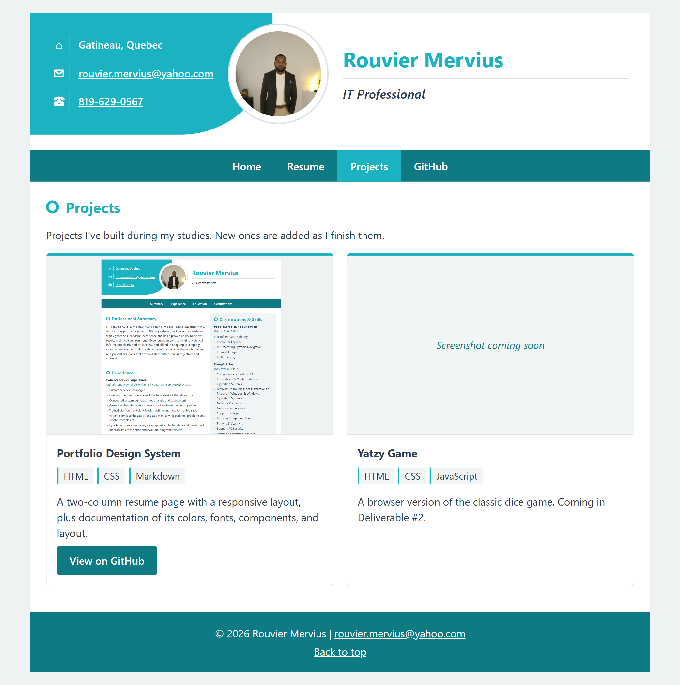

# Rouvier Mervius – Portfolio Design System

This document describes the design system for my portfolio website: the colors, fonts, components, and layout used across all of its pages.

## Pages

| Page | File | Purpose |
| --- | --- | --- |
| Home | `index.html` | Short introduction, buttons to the resume and projects, and highlight cards |
| Resume | `resume.html` | Full resume in a two-column layout |
| Projects | `projects.html` | Project cards with screenshots, added throughout the semester |

All pages share the same header, navigation bar, and footer.

## Mock-ups

### Home page

### Projects page

### Resume page (desktop)

### Resume page (mobile)

## Color Palette

| Role | Color | Where it is used |
| --- | --- | --- |
| Primary | `#1bb3c1` (teal) | Contact panel, name, section headings, list markers, current nav page, card top border |
| Primary Dark | `#0e7a84` (dark teal) | Nav bar, footer, buttons, links, dates and locations |
| Text | `#2c3e50` (dark slate) | Body text and titles |
| Background | `#eef2f3` (light gray) | Area behind the page |
| Page | `#ffffff` (white) | Page background, cards, photo border |
| Shaded | `#f2f5f6` (very light gray) | Resume right column, tags inside cards, screenshot placeholders |
| Border | `#d9e1e3` (soft gray) | Section dividers, card borders, photo ring |

All colors are stored as CSS variables in `:root` at the top of `styles.css`, so the whole theme can be changed in one place.

## Typography

- **All text:** "Segoe UI", Arial, sans-serif
- **Name (h1):** 2rem, bold, primary color
- **Section headings (h2):** 1.4rem, bold, primary color, with a teal ring marker in front
- **Card and entry titles (h3):** 1.05rem, bold, text color
- **Body text and lists:** 1rem, line height 1.5
- **Dates and locations:** 0.95rem, italic, primary dark color
- **Title under name:** 1.2rem, semi-bold, italic
- **Buttons and nav links:** semi-bold

## Components

### Shared on every page

- **Header:** A teal contact panel with a curved bottom-right corner (location, email, phone), a round photo with a white border that overlaps the panel, and my name with my title underneath.
- **Nav:** Dark teal bar with white links to Home, Resume, Projects, and my GitHub profile. The current page is highlighted in primary teal, and links turn primary teal on hover.
- **Footer:** Dark teal background with centered white text, my email, and a "Back to top" link.

### Recurring components

- **Project card:** White box with a teal top border and soft gray outline. Contains a screenshot (or a "Screenshot coming soon" placeholder), a title, technology tags, a short description, and an optional button. New projects are added by copying a card.
- **Highlight card:** The same card without an image, used on the Home page for quick facts.
- **Buttons:** Two styles. The primary button is solid dark teal with white text; the outline button is white with a dark teal border. Both turn primary teal on hover.
- **Tags:** Small labels with a teal left border, used for skills and technologies.
- **Sections:** Each starts with a teal heading with a ring marker and is separated by a soft gray line.
- **Entries:** Each job, school, or certification has a bold title, an italic line for the place and dates, and an optional list.
- **Lists:** Custom teal arrow markers (›) instead of default bullets.

## Layout

- **Page:** Centered white page, maximum width 950px, on a light gray background.
- **Header:** CSS Grid with three columns (contact panel, photo, name).
- **Nav list:** Flexbox in a horizontal row.
- **Home and Projects pages:** A single content column. Cards are placed in a CSS Grid that fits as many cards per row as there is room for (each at least 250px wide).
- **Resume page:** CSS Grid with two columns. The left column (3fr) holds Summary, Experience, Education, Technical Training, and Qualifications. The right column (2fr) has a shaded background and holds Certifications & Skills.

### Responsive design (screens 700px wide and smaller)

- The header stacks vertically: photo, then name and title, then the contact panel with rounded bottom corners.
- The nav links switch from a horizontal row to a vertical list.
- The resume's two columns stack into one.
- Cards stack into a single column automatically.
- Heading font sizes get slightly smaller.
