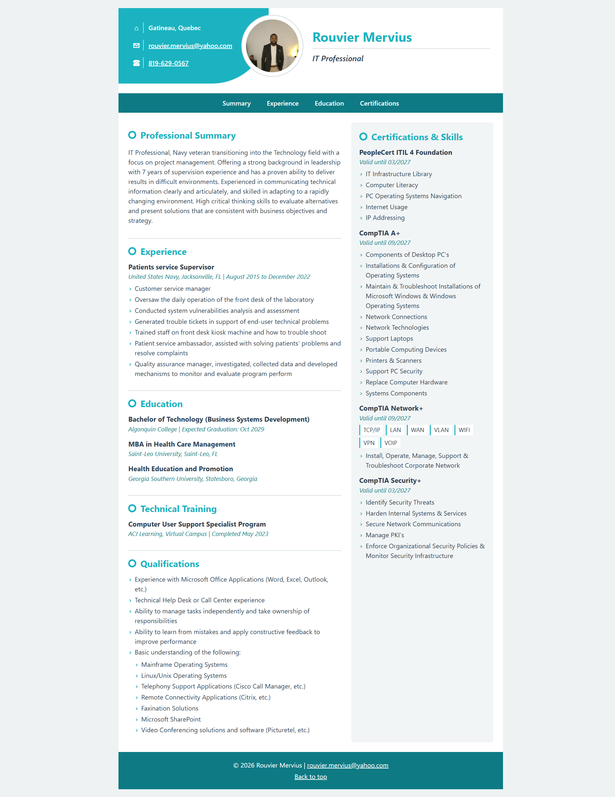
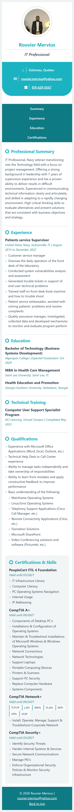

# Rouvier Mervius – Portfolio Design System

This document describes the design system for my portfolio resume page: the colors, fonts, components, and layout used to build it.

## Mock-ups

### Desktop view

### Mobile view

## Color Palette

| Role | Color | Where it is used |
| --- | --- | --- |
| Primary | `#1bb3c1` (teal) | Contact panel, name, section headings, list markers |
| Primary Dark | `#0e7a84` (dark teal) | Nav bar, footer, links, dates and locations |
| Text | `#2c3e50` (dark slate) | Body text and job titles |
| Background | `#eef2f3` (light gray) | Area behind the page |
| Page | `#ffffff` (white) | Resume page, photo border, skill tags |
| Shaded Column | `#f2f5f6` (very light gray) | Right column background |
| Border | `#d9e1e3` (soft gray) | Section dividers, photo ring, line under title |

All colors are stored as CSS variables in `:root` at the top of `styles.css`, so the whole theme can be changed in one place.

## Typography

- **All text:** "Segoe UI", Arial, sans-serif
- **Name (h1):** 2rem, bold, primary color
- **Section headings (h2):** 1.4rem, bold, primary color, with a teal ring marker in front
- **Job titles and certifications (h3):** 1.05rem, bold, text color
- **Body text and lists:** 1rem, line height 1.5
- **Dates and locations:** 0.95rem, italic, primary dark color
- **Title under name:** 1.2rem, semi-bold, italic

## Components

- **Header:** Three parts side by side: a teal contact panel with a curved bottom-right corner (location, email, phone), a round photo with a white border that overlaps the panel, and my name with my title underneath.
- **Nav:** Dark teal bar with white links to the main sections (Summary, Experience, Education, Certifications). Links turn primary teal on hover.
- **Sections:** White background, each starting with a teal heading and separated by a soft gray line.
- **Entries:** Each job, school, or certification has a bold title, an italic line for the place and dates, and an optional list.
- **Lists:** Custom teal arrow markers (›) instead of default bullets.
- **Skill tags:** Short skills (TCP/IP, LAN, VPN, etc.) shown as small white tags with a teal left border.
- **Footer:** Dark teal background with centered white text, my email, and a "Back to top" link.

## Layout

- **Page:** Centered white page, maximum width 950px, on a light gray background.
- **Content:** CSS Grid with two columns. The left column (wider, 3fr) holds Summary, Experience, Education, Technical Training, and Qualifications. The right column (2fr) has a shaded background and holds Certifications & Skills.
- **Header:** CSS Grid with three columns (contact panel, photo, name).
- **Nav list:** Flexbox in a horizontal row.

### Responsive design (screens 700px wide and smaller)

- The two content columns stack into a single column.
- The header stacks vertically: photo first, then name and title, then the contact panel with rounded bottom corners.
- The nav links switch from a horizontal row to a vertical list.
- Font sizes for headings get slightly smaller.
